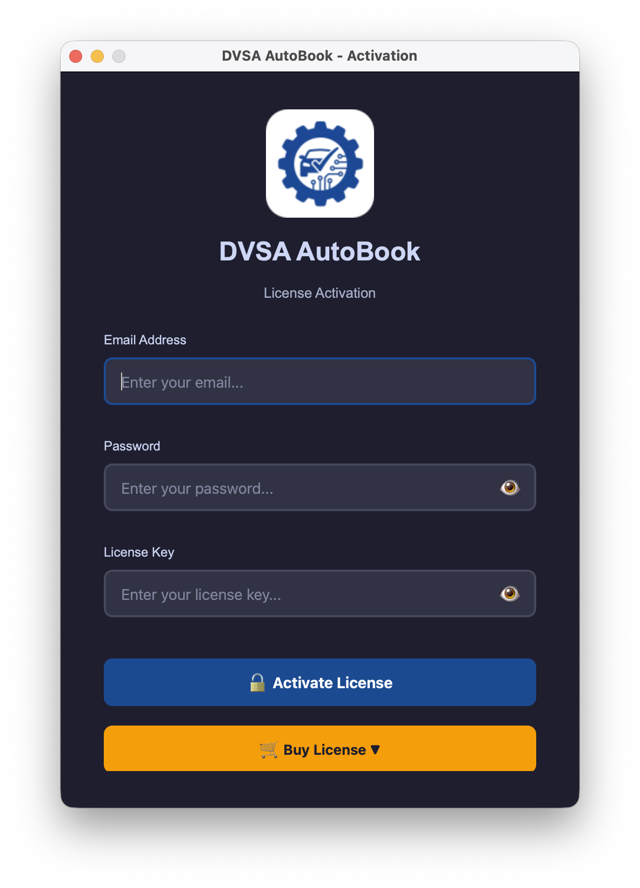
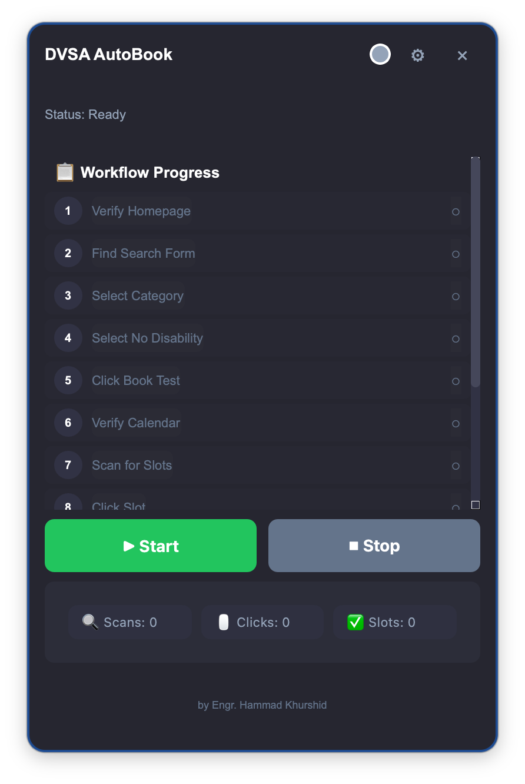
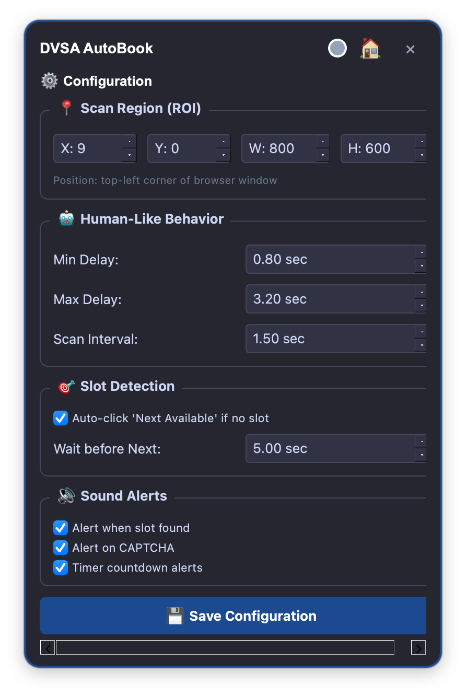
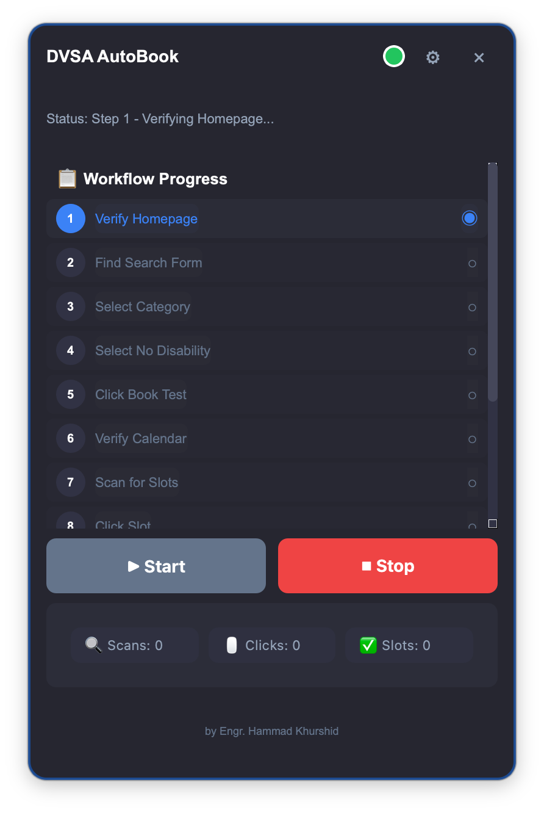
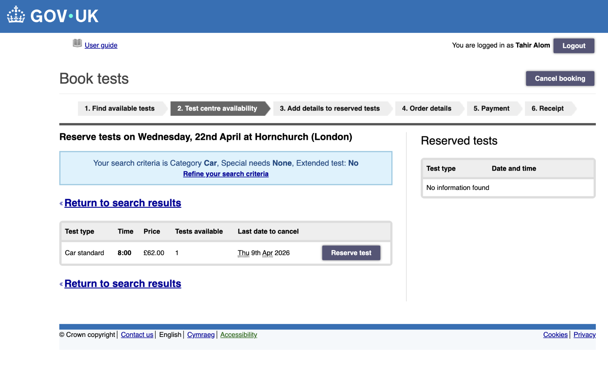

<p align="center">
  
</p>

<h1 align="center">🚗 DVSA AutoBook</h1>

<p align="center">
  <strong>Intelligent Driving Test Booking Automation for UK DVSA</strong>
</p>

<p align="center">
  <strong>Three purchase options available: DVSA AutoBook Chrom Extension, DVSA AutoBook Pro GUI, and DVSA AutoBook Prro.</strong>
</p>

<p align="center">
  <a href="#features">Features</a> •
  <a href="#how-it-works">How It Works</a> •
  <a href="#installation">Installation</a> •
  <a href="#screenshots">Screenshots</a> •
  <a href="#pricing">Pricing</a> •
  <a href="#support">Support</a>
</p>

<p align="center">
  
  
  
</p>

<p align="center">
  
  
  
</p>

---

## 🎉 LIMITED TIME OFFER — APRIL 2026

<div align="center">

### 🔥 **20% OFF ALL BOTS THIS MONTH** 🔥

<h2 style="color: #ff6b6b; font-size: 2.5em; margin: 10px 0;">💰 SAVE NOW!</h2>

#### Choose Your Discount:

| Discount | Offer |
|----------|-------|
| **20% OFF** | All DVSA AutoBook tools this month only |
| **50% OFF** | Purchase 5+ licenses (bulk orders) |
| **Reseller License** | Full source code, lifetime updates, unlimited activations — now £5,250 (was £10,500) |

<p style="font-size: 1.1em; font-weight: bold; color: #2ecc71;">⏰ Offer Valid: April 2026 Only</p>

#### 🎯 Ready to Get Started?

<a href="mailto:engr.hammadkhurshid@gmail.com?subject=DVSA%20AutoBook%20-%20April%202026%20Offer">
  
</a>

**📧 Email:** engr.hammadkhurshid@gmail.com  
**💬 WhatsApp:** +92 336 7126719  
**⏱️ Limited slots available — contact now!**

</div>

---

<p align="center">
  
</p>

---

## 🎯 The Problem

Booking a UK driving test through the DVSA website is **extremely frustrating**:

- ❌ **Limited Slots** — Test centres are booked months in advance
- ❌ **Constant Refreshing** — You need to manually check for cancellations 24/7
- ❌ **Slow Manual Process** — By the time you click, the slot is gone
- ❌ **Time Wasted** — Hours spent refreshing pages with no results

> *"I spent 3 weeks refreshing the DVSA website every hour. DVSA AutoBook found me a slot in 2 days."*

---

## ✨ The Solution

**DVSA AutoBook** is an intelligent automation tool that monitors the DVSA booking system and **instantly reserves available slots** — all while mimicking natural human behaviour.

### 🧭 Product Lineup

Choose the version that matches the level of automation you need:

| Product | What It Includes | Price |
|---------|-------------------|-------|
| **DVSA AutoBook Chrom Extension** | Slot search and reservation automatically, manual captcha handling, no Error 15 handling | **£550** |
| **DVSA AutoBook Pro GUI** | Slot search and reservation, manual portal login and navigation, manual captcha, no Error 15 handling | **£600** |
| **DVSA AutoBook Prro** | Automated portal access, login, navigation, slot search, slot reservation, notifications, captcha handling, Error 15 handling, auto session handling, proxy handling, and advanced bot controls | **£2,500** |

### ✅ Included With Every Option

- Full source code
- Build file included
- Lifetime access to the tool you purchase
- Setup guidance and installation help
- Ongoing support for activation and usage questions
- Private delivery and direct contact with the seller

> **Discounts available:** 20% off for a limited-time purchase window, or 50% off for bulk orders of 5 licenses or more.

### 🛡️ Human-in-the-Loop Automation

Unlike generic bots that rely on noisy automation, DVSA AutoBook uses a controlled workflow:

| Feature | How It Works |
|---------|--------------|
| **🖱️ Human-Like Mouse Movement** | Bezier curve trajectories that mimic natural hand movements |
| **⏱️ Random Timing Delays** | Variable pauses between actions (no robotic patterns) |
| **👁️ Visual Page Detection** | Template matching to verify page state before acting |
| **🧩 Manual CAPTCHA** | You solve CAPTCHAs yourself in the first two options, or use the advanced handling in Prro |
| **🎯 Smart Click Targeting** | Finds UI elements visually, not by scraping HTML |

> **Result:** You get the right level of automation for your workflow, from lightweight assistance to a more advanced all-in-one system.

---

## 🔥 Features

<table>
<tr>
<td width="50%">

### 🚀 Core Features

- ✅ **Automatic Slot Detection** — Monitors for available appointments
- ✅ **Instant Reservation** — Clicks faster than humanly possible
- ✅ **Sound Alerts** — Get notified when slots are found
- ✅ **15-Minute Timer** — Countdown for DVSA's reservation window
- ✅ **CAPTCHA Alerts** — Notifies you to solve manually
- ✅ **One-Click Stop** — Emergency stop at any time

</td>
<td width="50%">

### 🛡️ Safety Features

- ✅ **Human-Like Behaviour** — Undetectable automation
- ✅ **No Browser Automation** — Uses screen capture, not Selenium
- ✅ **No Data Scraping** — Visual element detection only
- ✅ **Offline License** — No server calls, complete privacy
- ✅ **No Account Risk** — Mimics genuine user behaviour
- ✅ **Clean Architecture** — No malware, no keyloggers

</td>
</tr>
</table>

---

## 🔄 How It Works

```
┌─────────────────────────────────────────────────────────────────┐
│                     DVSA AutoBook Workflow                       │
└─────────────────────────────────────────────────────────────────┘

    ┌──────────┐      ┌──────────┐      ┌──────────┐
    │  START   │ ───▶ │  LOGIN   │ ───▶ │  SCAN    │
    │   App    │      │  to DVSA │      │  Pages   │
    └──────────┘      └──────────┘      └────┬─────┘
                                             │
                      ┌──────────────────────┴──────────────────────┐
                      ▼                                              ▼
               ┌──────────┐                                   ┌──────────┐
               │ CAPTCHA? │ ◀─── 🔔 Alert + Sound ────────── │  SLOT    │
               │  Solve   │                                   │  FOUND!  │
               │ Manually │                                   └────┬─────┘
               └────┬─────┘                                        │
                    │                                              ▼
                    │                                       ┌──────────┐
                    └────────────────────────────────────▶  │ RESERVE  │
                                                            │   Slot   │
                                                            └────┬─────┘
                                                                 │
                                                                 ▼
                                                          ┌──────────┐
                                                          │ 15-MIN   │
                                                          │  TIMER   │
                                                          └────┬─────┘
                                                                 │
                                                                 ▼
                                                          ┌──────────┐
                                                          │ COMPLETE │
                                                          │ Payment  │
                                                          │ Manually │
                                                          └──────────┘
```

### Step-by-Step Process:

1. **🔐 Activate** — Enter your license credentials
2. **🌐 Open DVSA** — Navigate to the booking website in your browser
3. **▶️ Start Bot** — Click Start and let the app take over
4. **🧩 Solve CAPTCHA** — When alerted, complete the CAPTCHA yourself
5. **🎉 Slot Reserved** — The app reserves the slot; you complete payment

---

---

## 📸 Screenshots

<p align="center">
  
  <br>
  <em>Secure License Activation</em>
</p>

<p align="center">
  
  <br>
  <em>Clean, Modern Dashboard</em>
</p>

<p align="center">
  
  <br>
  <em>Easy Configuration Settings</em>
</p>

<p align="center">
  
  <br>
  <em>Real-Time Automation in Action</em>
</p>

<p align="center">
  
  <br>
  <em>🎉 Slot Found & Reserved!</em>
</p>


## 💻 Installation

### System Requirements

| Platform | Minimum | Recommended |
|----------|---------|-------------|
| **macOS** | 10.13 High Sierra | 12.0 Monterey+ |
| **Windows** | Windows 10 | Windows 11 |
| **RAM** | 4 GB | 8 GB |
| **Storage** | 500 MB | 1 GB |

### macOS Installation

1. **Download** `DVSA-AutoBook-macOS.dmg` from [Releases](../../releases)
2. **Open** the DMG file
3. **Drag** `DVSA AutoBook.app` to your Applications folder
4. **First Launch:**
   - Right-click the app → Click **Open**
   - Click **Open** in the security dialog
5. **Grant Permissions:**
   - Go to **System Preferences → Privacy & Security**
   - Enable **Screen Recording** for DVSA AutoBook
   - Enable **Accessibility** for DVSA AutoBook
6. **Activate** with your license credentials

### Windows Installation

1. **Download** `DVSA-AutoBook-Windows.zip` from [Releases](../../releases)
2. **Extract** the ZIP file
3. **Run** `DVSA AutoBook.exe`
4. **First Launch:**
   - Click **More info** → **Run anyway** (Windows Defender)
5. **Activate** with your license credentials

---

## 🔐 Licensing

DVSA AutoBook uses **offline license validation**. Your credentials work without internet verification — complete privacy guaranteed.

### How to Activate

1. Launch the application
2. Enter your **Email**, **Password**, and **License Key**
3. Click **Activate**
4. ✅ You're ready to go!

> 📧 **Lost your license?** Contact support at engr.hammadkhurshid@gmail.com

---

## 💰 Pricing

<table align="center">
<tr>
<td align="center" width="50%">

### 🌐 DVSA AutoBook Chrom Extension

<h1>£550</h1>

**Slot search and reservation with manual captcha handling**

---

✅ Slot search and reservation automatically  
✅ Manual captcha handling  
✅ No Error 15 handling  
✅ Full source code  
✅ Build file included  
✅ Lifetime access  
✅ Setup guidance and support  

---

<a href="mailto:engr.hammadkhurshid@gmail.com?subject=DVSA%20AutoBook%20Chrom%20Extension">
  
</a>

</td>
<td align="center" width="50%">

### 🖥️ DVSA AutoBook Pro GUI

<h1>£600</h1>

**GUI-based booking with manual portal login and navigation**

---

✅ Slot search and reservation  
✅ Manual portal login and navigation  
✅ Manual captcha handling  
✅ No Error 15 handling  
✅ Full source code  
✅ Build file included  
✅ Lifetime access  
✅ Setup guidance and support  

---

<a href="mailto:engr.hammadkhurshid@gmail.com?subject=DVSA%20AutoBook%20Pro%20GUI">
  
</a>

</td>
</tr>
</table>

<p align="center">
  <em>💳 Payment via Bank Transfer or Cryptocurrency</em>
</p>

<p align="center">
  <strong>Limited-time offer:</strong> 20% discount available now, or 50% discount for bulk orders of 5 licenses or more.
</p>

<table align="center">
<tr>
<td align="center" colspan="2">

### 🚀 DVSA AutoBook Prro

<h1>£2,500</h1>

**Most advanced bot with end-to-end automation**

---

✅ Automated portal access, login, and navigation  
✅ Slot search and slot reservation  
✅ Notifications and captcha handling  
✅ Error 15 handling  
✅ Auto session handling  
✅ Proxy handling  
✅ Full source code  
✅ Build file included  
✅ Lifetime access  
✅ Setup guidance and support  

---

<a href="mailto:engr.hammadkhurshid@gmail.com?subject=DVSA%20AutoBook%20Prro">
  
</a>

</td>
</tr>
</table>

---

## 🛡️ Security & Privacy

| Aspect | Our Approach |
|--------|--------------|
| **Data Collection** | ❌ None — we don't collect any data |
| **Network Calls** | ❌ None — fully offline operation |
| **License Validation** | ✅ Offline SHA-256 hash verification |
| **Your Credentials** | ✅ Stored locally on YOUR device only |
| **DVSA Account** | ✅ You login yourself — we never see your password |

> 🔒 **Your privacy is paramount.** The app runs entirely on your machine with zero external communication.

---

## ❓ FAQ

<details>
<summary><strong>Is this legal?</strong></summary>

Yes. DVSA AutoBook is an automation tool that helps you interact with a website faster. It does not:
- Bypass any security measures
- Create fake bookings
- Use stolen credentials
- Violate DVSA terms (you're still making a legitimate booking)

</details>

<details>
<summary><strong>Will I get banned?</strong></summary>

No. DVSA AutoBook mimics human behaviour with:
- Natural mouse movements
- Random timing delays
- Manual CAPTCHA solving
- Visual element detection (not HTML scraping)

The system sees a normal user, not a bot.

</details>

<details>
<summary><strong>Why is CAPTCHA manual?</strong></summary>

This is a **feature, not a limitation**. Automated CAPTCHA solving:
1. Is detectable and leads to bans
2. Often fails on complex CAPTCHAs
3. Adds legal/ethical concerns

By keeping CAPTCHA manual, we ensure you're never flagged as a bot.

</details>

<details>
<summary><strong>What if no slots are found?</strong></summary>

DVSA AutoBook continuously monitors. Cancellation slots appear randomly — the app will catch them the moment they're available.

</details>

<details>
<summary><strong>Can I use this on multiple computers?</strong></summary>

- **Chrom Extension:** 1 device
- **Pro GUI:** 1 device
- **Prro:** Unlimited activations based on the agreement

</details>

<details>
<summary><strong>Do I need technical knowledge?</strong></summary>

No. Just download, install, activate, and click Start. It's that simple.

</details>

---

## 📞 Support

<table>
<tr>
<td align="center">
  <h3>📧 Email Support</h3>
  <a href="mailto:engr.hammadkhurshid@gmail.com">engr.hammadkhurshid@gmail.com</a>
  <br>
  <em>Response within 24 hours</em>
</td>
<td align="center">
  <h3>💬 WhatsApp</h3>
  <a href="https://wa.me/+923367126719">+92 336 7126719</a>
  <br>
  <em>Real-time support</em>
</td>
<td align="center">
  <h3>🐙 GitHub</h3>
  <a href="https://github.com/engrhammadkhurshid">@engrhammadkhurshid</a>
  <br>
  <em>Issues & Updates</em>
</td>
</tr>
</table>

---

## 📋 Changelog

### v1.0.0 (November 2025)
- 🎉 Initial release
- ✨ Human-like mouse movement with Bezier curves
- ✨ 12-step DVSA booking workflow
- ✨ Sound alerts for slots and CAPTCHAs
- ✨ 15-minute reservation timer
- ✨ Offline license validation
- ✨ macOS and Windows support

---

## 📜 Disclaimer

DVSA AutoBook is provided "as is" without warranty of any kind. The developers are not responsible for:
- Any actions taken by DVSA against your account
- Missed bookings or failed reservations
- Changes to the DVSA website that may affect functionality

By using this software, you agree to use it responsibly and in compliance with all applicable laws and terms of service.

---

<p align="center">
  <strong>Made with ❤️ by Engr. Hammad Khurshid</strong>
</p>

<p align="center">
  <a href="mailto:engr.hammadkhurshid@gmail.com">📧 Contact</a> •
  <a href="https://github.com/engrhammadkhurshid">🐙 GitHub</a> •
  <a href="https://linkedin.com/in/engrhammadkhurshid">💼 LinkedIn</a>
</p>

<p align="center">
  <em>© 2025 DVSA AutoBook. All Rights Reserved.</em>
</p>
